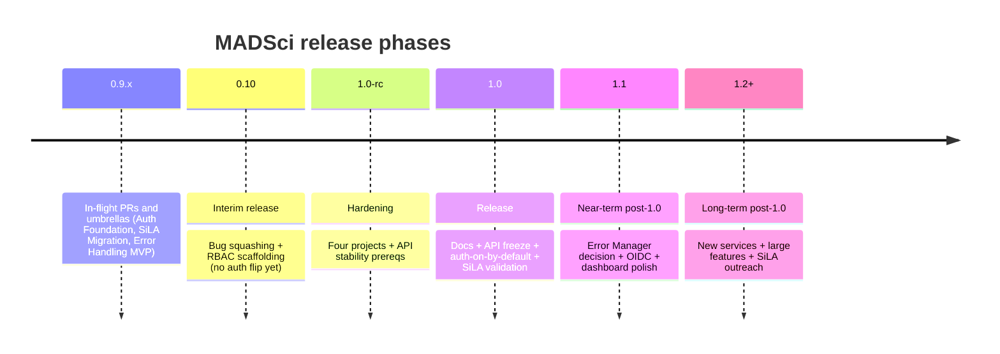
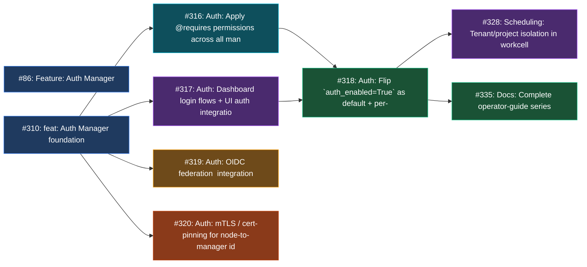
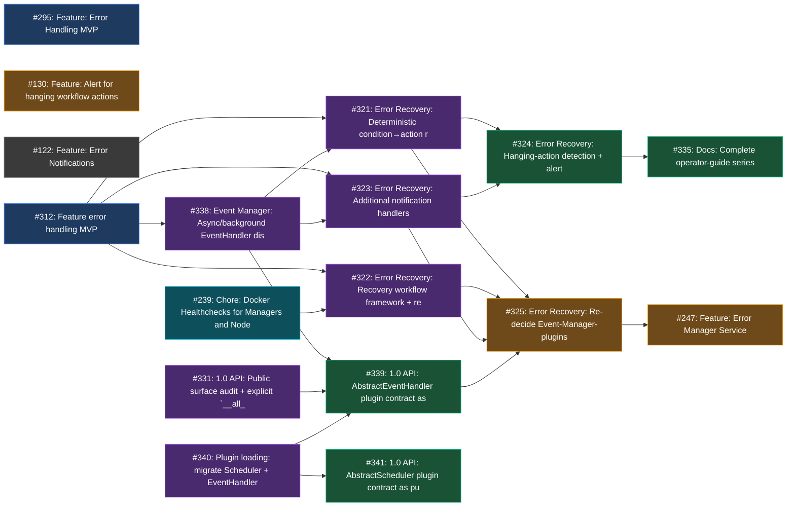
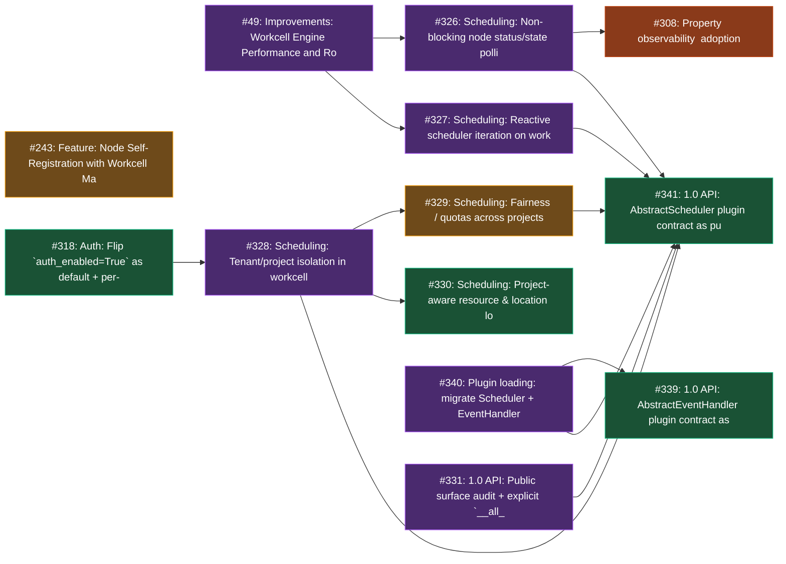
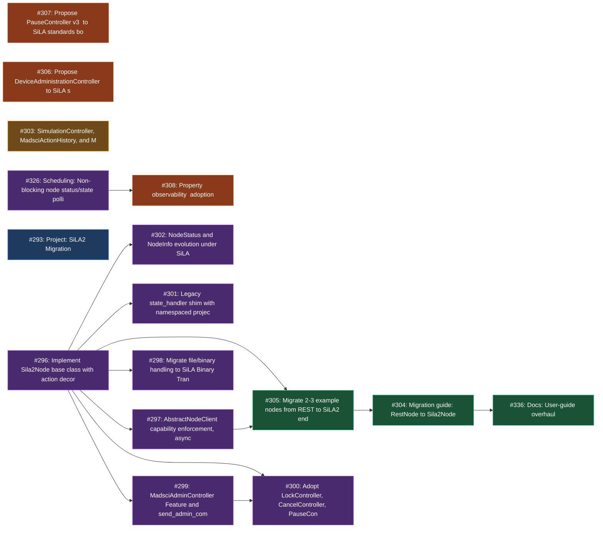
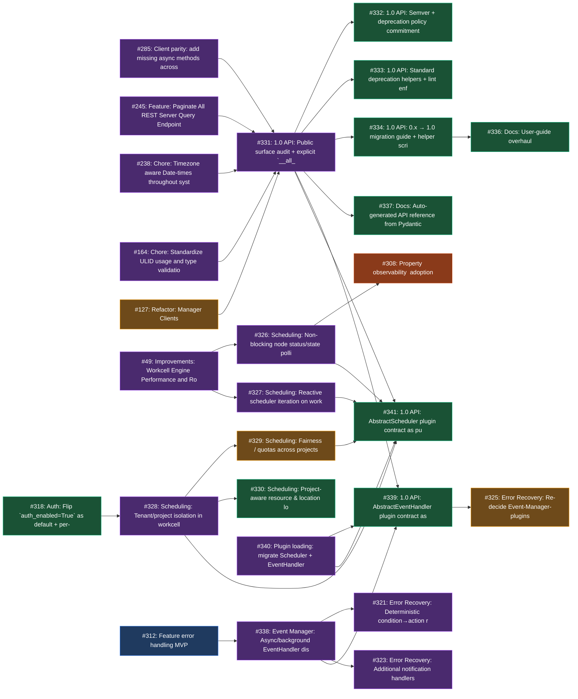
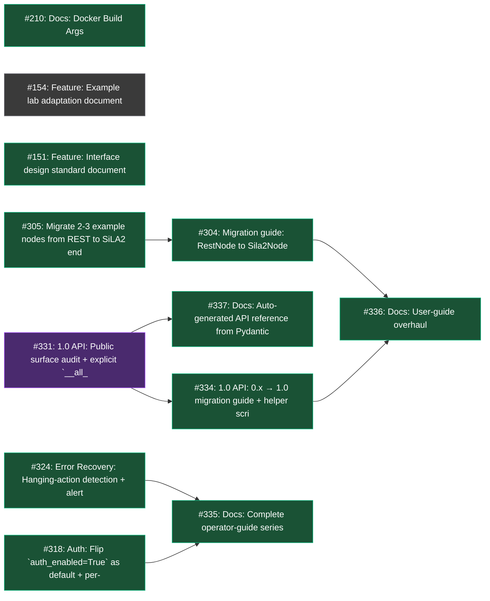

# MADSci → 1.0 Roadmap

_This roadmap reflects the path from the current 0.9.x line to a 1.0 release, with four major projects and two cross-cutting initiatives forming the bulk of the work. It is a living document — phases, dependencies, and project scope will evolve as we learn._

**Last updated:** 2026-05-29
**Cards tracked:** 106 (0 drafts, 104 issues, 2 PRs)
**Dependencies tracked:** 58

## Contents

- [Executive summary](#executive-summary)
- [Release phases](#release-phases)
- [Projects](#projects)
  - [Auth Manager](#auth-manager)
  - [Advanced Error Recovery](#advanced-error-recovery)
  - [Robust Multi-tenant Scheduling](#robust-multi-tenant-scheduling)
  - [SiLA2 Migration](#sila2-migration)
  - [1.0 Public API Surface](#10-public-api-surface)
  - [Documentation Completeness](#documentation-completeness)
- [Cross-cutting work](#cross-cutting-work)
- [Phase contents](#phase-contents)
- [Issue triage outcomes](#issue-triage-outcomes)
- [Open risks](#open-risks)

## Executive summary

MADSci's path to 1.0 is anchored by four major projects, plus two cross-cutting initiatives that gate the release:

**The four projects (1.0 blockers):**

- 🔐 **Auth Manager** — Authentication and authorization. 7 cards total, 1 in 1.0-rc, 1 in 1.0 release.
- 🚨 **Advanced Error Recovery** — Detect, react to, and recover from errors automatically. 13 cards total, 5 in 1.0-rc, 2 in 1.0 release.
- ⚖️ **Robust Multi-tenant Scheduling** — Workcell scheduler that supports multiple tenants safely. 9 cards total, 5 in 1.0-rc, 2 in 1.0 release.
- 🔌 **SiLA2 Migration** — Adopt SiLA2 as the native node protocol. 14 cards total, 7 in 1.0-rc, 2 in 1.0 release.

**Cross-cutting (also 1.0 blockers):**

- 📐 **1.0 Public API Surface** — Lock the public API for the 1.0 commitment. 18 cards total.
- 📚 **Documentation Completeness** — Docs that let new operators stand up MADSci unaided. 8 cards total.

The release plan splits work across **seven phases** — see [Release phases](#release-phases) below. A target of roughly three months to 1.0 is aggressive given the density of 1.0-rc work; the first natural pressure-release valves are documented under [Open risks](#open-risks).

**Currently in review for merge:** PR [#310](https://github.com/AD-SDL/MADSci/pull/310) (Auth Manager foundation) and PR [#312](https://github.com/AD-SDL/MADSci/pull/312) (Error Handling MVP). These two PRs unblock the majority of the Auth Manager and Advanced Error Recovery downstream work in 0.10 and 1.0-rc.

## Release phases

| Phase                                 | Cards | 1.0-blocker |
| ------------------------------------- | ----- | ----------- |
| 0.9.x — In Flight                     | 15    | 6           |
| 0.10 — Interim Release                | 7     | 2           |
| 1.0-rc — Hardening                    | 22    | 21          |
| 1.0 — Release                         | 15    | 15          |
| 1.1 — Near-term Post-1.0              | 21    | 0           |
| 1.2+ — Long-term Post-1.0             | 21    | 0           |
| Icebox / Recommended for Close/Update | 5     | 0           |

Phase contents are enumerated in full under [Phase contents](#phase-contents).

## Projects

### 🔐 Auth Manager

_Authentication and authorization._

**7 cards** across phases:

- **0.9.x — In Flight** (2): #86, #310
- **0.10 — Interim Release** (1): #316
- **1.0-rc — Hardening** (1): #317
- **1.0 — Release** (1): #318
- **1.1 — Near-term Post-1.0** (1): #319
- **1.2+ — Long-term Post-1.0** (1): #320

**Dependency graph:**

### 🚨 Advanced Error Recovery

_Detect, react to, and recover from errors automatically._

**13 cards** across phases:

- **0.9.x — In Flight** (2): #295, #312
- **1.0-rc — Hardening** (5): #321, #322, #323, #338, #340
- **1.0 — Release** (2): #324, #339
- **1.1 — Near-term Post-1.0** (3): #247, #130, #325
- **Icebox / Recommended for Close/Update** (1): #122

**Dependency graph:**

### ⚖️ Robust Multi-tenant Scheduling

_Workcell scheduler that supports multiple tenants safely._

**9 cards** across phases:

- **1.0-rc — Hardening** (5): #49, #326, #327, #328, #340
- **1.0 — Release** (2): #330, #341
- **1.1 — Near-term Post-1.0** (2): #243, #329

**Dependency graph:**

### 🔌 SiLA2 Migration

_Adopt SiLA2 as the native node protocol._

**14 cards** across phases:

- **0.9.x — In Flight** (1): #293
- **1.0-rc — Hardening** (7): #302, #301, #300, #299, #298, #297, #296
- **1.0 — Release** (2): #305, #304
- **1.1 — Near-term Post-1.0** (1): #303
- **1.2+ — Long-term Post-1.0** (3): #308, #307, #306

**Dependency graph:**

## Cross-cutting work

### 📐 1.0 Public API Surface

_Lock the public API for the 1.0 commitment._

**18 cards** across phases:

- **1.0-rc — Hardening** (11): #285, #245, #238, #164, #49, #326, #327, #328, #331, #338, #340
- **1.0 — Release** (5): #332, #333, #334, #339, #341
- **1.1 — Near-term Post-1.0** (2): #127, #329

**Dependency graph** (nodes from other projects — SiLA, Scheduling, Auth, Error Recovery, Docs — are shown as upstream/downstream context; only the cards listed above are in-scope for this project):

### 📚 Documentation Completeness

_Docs that let new operators stand up MADSci unaided._

**8 cards** across phases:

- **1.0 — Release** (7): #304, #210, #151, #334, #335, #336, #337
- **Icebox / Recommended for Close/Update** (1): #154

**Dependency graph:**

## Phase contents

The complete contents of each phase column. Cards are grouped by project where applicable.

### 0.9.x — In Flight

_Status snapshot (2026-05-29): PRs #310 (Auth foundation) and #312 (Error handling MVP) are under review for merge and effectively gate the downstream Auth and Error Recovery chains. #281 closed by merged PR #342 on 2026-05-28. Three new packaging/runtime bugs (#343, #344, #345) filed from self-driving-lab integration — all tagged blockers. The 6 tagged 1.0 blockers (#209, #251, #277, #343, #344, #345) are all open bugs not yet picked up._

**Auth Manager**

- 📋 [#86](https://github.com/AD-SDL/MADSci/issues/86) — Feature: Auth Manager
- 🔧 [#310](https://github.com/AD-SDL/MADSci/pull/310) — feat(auth): Auth Manager foundation (OpenSpec auth-manager-foundation) — **under review for merge**

**Advanced Error Recovery**

- 📋 [#295](https://github.com/AD-SDL/MADSci/issues/295) — Feature: Error Handling MVP
- 🔧 [#312](https://github.com/AD-SDL/MADSci/pull/312) — Feature error handling MVP — `plugin-system` — **under review for merge**

**SiLA2 Migration**

- 📋 [#293](https://github.com/AD-SDL/MADSci/issues/293) — Project: SiLA2 Migration

**Other**

- 📋 [#237](https://github.com/AD-SDL/MADSci/issues/237) — Bug: Bad Permissions for OTEL Containers on non-MacOS
- 📋 [#209](https://github.com/AD-SDL/MADSci/issues/209) — Bug: rate_limit_requests variable default is mismatched between MADSci and MADSci Nodes — `1.0-blocker`
- 📋 [#251](https://github.com/AD-SDL/MADSci/issues/251) — Bug: Location Resource Attachments Lost on Docker Restart — `1.0-blocker`
- 📋 [#277](https://github.com/AD-SDL/MADSci/issues/277) — Fix timeout=0.0 treated as falsy across all client methods — `1.0-blocker`
- 📋 [#284](https://github.com/AD-SDL/MADSci/issues/284) — CLI output: handle nested Pydantic models in dict values
- 📋 [#211](https://github.com/AD-SDL/MADSci/issues/211) — Bug: workflow get datapoint by id ignores label if it can’t find it
- 📋 [#289](https://github.com/AD-SDL/MADSci/issues/289) — RateLimitTracker: handle malformed rate-limit headers gracefully
- 📋 [#343](https://github.com/AD-SDL/MADSci/issues/343) — madsci-common: psycopg2-binary is mandatory but unused (blocks 32-bit Windows installs) — `1.0-blocker`
- 📋 [#344](https://github.com/AD-SDL/MADSci/issues/344) — event_client: double-fault when warning_category=<class> is shipped to event server — `1.0-blocker`
- 📋 [#345](https://github.com/AD-SDL/MADSci/issues/345) — madsci-common: filelock imported by registry/local_registry.py but not declared as a dependency — `1.0-blocker`

### 0.10 — Interim Release

**Auth Manager**

- 📋 [#316](https://github.com/AD-SDL/MADSci/issues/316) — Auth: Apply @requires permissions across all manager endpoints — `1.0-blocker`

**Other**

- 📋 [#239](https://github.com/AD-SDL/MADSci/issues/239) — Chore: Docker Healthchecks for Managers and Nodes — `1.0-blocker`
- 📋 [#269](https://github.com/AD-SDL/MADSci/issues/269) — Improvement: Allow connections on localhost by default
- 📋 [#280](https://github.com/AD-SDL/MADSci/issues/280) — Retry transport: respect Retry-After header on 429 responses
- 📋 [#286](https://github.com/AD-SDL/MADSci/issues/286) — CLI tests: verify mock call arguments, not just exit codes
- 📋 [#287](https://github.com/AD-SDL/MADSci/issues/287) — Tests: add async method coverage for service clients
- 📋 [#288](https://github.com/AD-SDL/MADSci/issues/288) — CLI tests: add error-path tests for connection failures

### 1.0-rc — Hardening

**Auth Manager**

- 📋 [#317](https://github.com/AD-SDL/MADSci/issues/317) — Auth: Dashboard login flows + UI auth integration — `1.0-blocker`

**Advanced Error Recovery**

- 📋 [#338](https://github.com/AD-SDL/MADSci/issues/338) — Event Manager: Async/background EventHandler dispatch — `1.0-blocker` `plugin-system`
- 📋 [#321](https://github.com/AD-SDL/MADSci/issues/321) — Error Recovery: Deterministic condition→action rule engine (as EventHandler plugin) — `1.0-blocker`
- 📋 [#322](https://github.com/AD-SDL/MADSci/issues/322) — Error Recovery: Recovery workflow framework + retry/cooldown/circuit-breaker primitives — `1.0-blocker`
- 📋 [#323](https://github.com/AD-SDL/MADSci/issues/323) — Error Recovery: Additional notification handlers (Slack/webhook) + criteria-rich dispatch — `1.0-blocker`

**Robust Multi-tenant Scheduling**

- 📋 [#326](https://github.com/AD-SDL/MADSci/issues/326) — Scheduling: Non-blocking node status/state polling — `1.0-blocker`
- 📋 [#327](https://github.com/AD-SDL/MADSci/issues/327) — Scheduling: Reactive scheduler iteration on workflow-queue change — `1.0-blocker`
- 📋 [#328](https://github.com/AD-SDL/MADSci/issues/328) — Scheduling: Tenant/project isolation in workcell scheduler — `1.0-blocker`
- 📋 [#49](https://github.com/AD-SDL/MADSci/issues/49) — Improvements: Workcell Engine Performance and Robustness

**SiLA2 Migration**

- 📋 [#296](https://github.com/AD-SDL/MADSci/issues/296) — Implement Sila2Node base class with action decorator surface — `1.0-blocker`
- 📋 [#297](https://github.com/AD-SDL/MADSci/issues/297) — AbstractNodeClient capability enforcement, async parity, and surface tightening — `1.0-blocker`
- 📋 [#298](https://github.com/AD-SDL/MADSci/issues/298) — Migrate file/binary handling to SiLA Binary Transfer — `1.0-blocker`
- 📋 [#299](https://github.com/AD-SDL/MADSci/issues/299) — MadsciAdminController Feature and send_admin_command dispatch — `1.0-blocker`
- 📋 [#300](https://github.com/AD-SDL/MADSci/issues/300) — Adopt LockController, CancelController, PauseController via vendor-and-PR — `1.0-blocker`
- 📋 [#301](https://github.com/AD-SDL/MADSci/issues/301) — Legacy state_handler shim with namespaced projection — `1.0-blocker`
- 📋 [#302](https://github.com/AD-SDL/MADSci/issues/302) — NodeStatus and NodeInfo evolution under SiLA — `1.0-blocker`

**1.0 Public API Surface**

- 📋 [#340](https://github.com/AD-SDL/MADSci/issues/340) — Plugin loading: migrate Scheduler + EventHandler config to Pydantic ImportString — `1.0-blocker` `plugin-system`
- 📋 [#331](https://github.com/AD-SDL/MADSci/issues/331) — 1.0 API: Public surface audit + explicit `__all__` exports — `1.0-blocker`
- 📋 [#164](https://github.com/AD-SDL/MADSci/issues/164) — Chore: Standardize ULID usage and type validation — `1.0-blocker`
- 📋 [#238](https://github.com/AD-SDL/MADSci/issues/238) — Chore: Timezone aware Date-times throughout system — `1.0-blocker`
- 📋 [#245](https://github.com/AD-SDL/MADSci/issues/245) — Feature: Paginate All REST Server Query Endpoints with Default Limits — `1.0-blocker`
- 📋 [#285](https://github.com/AD-SDL/MADSci/issues/285) — Client parity: add missing async methods across all service clients — `1.0-blocker`

### 1.0 — Release

**Auth Manager**

- 📋 [#318](https://github.com/AD-SDL/MADSci/issues/318) — Auth: Flip `auth_enabled=True` as default + per-manager rollout sequence — `1.0-blocker` `breaking`

**Advanced Error Recovery**

- 📋 [#324](https://github.com/AD-SDL/MADSci/issues/324) — Error Recovery: Hanging-action detection + alerting integration — `1.0-blocker`

**Robust Multi-tenant Scheduling**

- 📋 [#330](https://github.com/AD-SDL/MADSci/issues/330) — Scheduling: Project-aware resource & location locking — `1.0-blocker`

**SiLA2 Migration**

- 📋 [#304](https://github.com/AD-SDL/MADSci/issues/304) — Migration guide: RestNode to Sila2Node — `1.0-blocker`
- 📋 [#305](https://github.com/AD-SDL/MADSci/issues/305) — Migrate 2-3 example nodes from REST to SiLA2 end-to-end — `1.0-blocker`

**1.0 Public API Surface**

- 📋 [#339](https://github.com/AD-SDL/MADSci/issues/339) — 1.0 API: AbstractEventHandler plugin contract as public-API commitment — `1.0-blocker` `plugin-system`
- 📋 [#341](https://github.com/AD-SDL/MADSci/issues/341) — 1.0 API: AbstractScheduler plugin contract as public-API commitment — `1.0-blocker` `plugin-system`
- 📋 [#332](https://github.com/AD-SDL/MADSci/issues/332) — 1.0 API: Semver + deprecation policy commitment — `1.0-blocker`
- 📋 [#333](https://github.com/AD-SDL/MADSci/issues/333) — 1.0 API: Standard deprecation helpers + lint enforcement — `1.0-blocker`
- 📋 [#334](https://github.com/AD-SDL/MADSci/issues/334) — 1.0 API: 0.x → 1.0 migration guide + helper script — `1.0-blocker`

**Documentation Completeness**

- 📋 [#335](https://github.com/AD-SDL/MADSci/issues/335) — Docs: Complete operator-guide series (deployment, ops, recovery, upgrade) — `1.0-blocker`
- 📋 [#336](https://github.com/AD-SDL/MADSci/issues/336) — Docs: User-guide overhaul (getting started → first experiment → production) — `1.0-blocker`
- 📋 [#337](https://github.com/AD-SDL/MADSci/issues/337) — Docs: Auto-generated API reference from Pydantic models — `1.0-blocker`
- 📋 [#151](https://github.com/AD-SDL/MADSci/issues/151) — Feature: Interface design standard document — `1.0-blocker`
- 📋 [#210](https://github.com/AD-SDL/MADSci/issues/210) — Docs: Docker Build Args — `1.0-blocker`

### 1.1 — Near-term Post-1.0

**Auth Manager**

- 📋 [#319](https://github.com/AD-SDL/MADSci/issues/319) — Auth: OIDC federation (Globus, ORCID) integration

**Advanced Error Recovery**

- 📋 [#325](https://github.com/AD-SDL/MADSci/issues/325) — Error Recovery: Re-decide Event-Manager-plugins vs dedicated Error Manager
- 📋 [#130](https://github.com/AD-SDL/MADSci/issues/130) — Feature: Alert for hanging workflow actions
- 📋 [#247](https://github.com/AD-SDL/MADSci/issues/247) — Feature: Error Manager Service — `recommend-update`

**Robust Multi-tenant Scheduling**

- 📋 [#243](https://github.com/AD-SDL/MADSci/issues/243) — Feature: Node Self-Registration with Workcell Manager
- 📋 [#329](https://github.com/AD-SDL/MADSci/issues/329) — Scheduling: Fairness / quotas across projects

**SiLA2 Migration**

- 📋 [#303](https://github.com/AD-SDL/MADSci/issues/303) — SimulationController, MadsciActionHistory, and MadsciNodeLog Features

**1.0 Public API Surface**

- 📋 [#127](https://github.com/AD-SDL/MADSci/issues/127) — Refactor: Manager Clients

**Other**

- 📋 [#120](https://github.com/AD-SDL/MADSci/issues/120) — Improvement: Resource Template Lifecycle and Scopes
- 📋 [#123](https://github.com/AD-SDL/MADSci/issues/123) — Feature: Dashboard Experiment Views
- 📋 [#128](https://github.com/AD-SDL/MADSci/issues/128) — Feature: Lab-wide Context Management
- 📋 [#145](https://github.com/AD-SDL/MADSci/issues/145) — Chore: Add Automated Tests for Dashboard
- 📋 [#147](https://github.com/AD-SDL/MADSci/issues/147) — Chore: Improve Testing Speed
- 📋 [#202](https://github.com/AD-SDL/MADSci/issues/202) — Enhancement: Dashboard Resource Improvements
- 📋 [#203](https://github.com/AD-SDL/MADSci/issues/203) — Feature: Dashboard Transfer Tooling
- 📋 [#244](https://github.com/AD-SDL/MADSci/issues/244) — Feature: Standardized TypeScript Clients for All Managers and REST Nodes
- 📋 [#248](https://github.com/AD-SDL/MADSci/issues/248) — Feature: Just-in-Time Data Requests for Dashboard with Shared Store
- 📋 [#250](https://github.com/AD-SDL/MADSci/issues/250) — Bug: Dashboard Does Not Reflect Changes to Node Info Over Time
- 📋 [#278](https://github.com/AD-SDL/MADSci/issues/278) — Adopt DataTableView and ServiceAwareContainer widgets in TUI screens
- 📋 [#279](https://github.com/AD-SDL/MADSci/issues/279) — StepDetailScreen should accept typed WorkflowStep model instead of raw dict
- 📋 [#283](https://github.com/AD-SDL/MADSci/issues/283) — CLI: pass --limit to server for data/events query commands

### 1.2+ — Long-term Post-1.0

**Auth Manager**

- 📋 [#320](https://github.com/AD-SDL/MADSci/issues/320) — Auth: mTLS / cert-pinning for node-to-manager identity

**SiLA2 Migration**

- 📋 [#306](https://github.com/AD-SDL/MADSci/issues/306) — Propose DeviceAdministrationController to SiLA standards body
- 📋 [#307](https://github.com/AD-SDL/MADSci/issues/307) — Propose PauseController v3 (PauseAll/ResumeAll) to SiLA standards body
- 📋 [#308](https://github.com/AD-SDL/MADSci/issues/308) — Property observability (push) adoption (post-v1)

**Other**

- 📋 [#43](https://github.com/AD-SDL/MADSci/issues/43) — Feature: Experiment State and Checkpoints
- 📋 [#48](https://github.com/AD-SDL/MADSci/issues/48) — Improvement: Lab Manager Configuration Management
- 📋 [#85](https://github.com/AD-SDL/MADSci/issues/85) — Feature: Usage Analytics Dashboard
- 📋 [#116](https://github.com/AD-SDL/MADSci/issues/116) — Enhancement: Improve Workcell Actions
- 📋 [#124](https://github.com/AD-SDL/MADSci/issues/124) — Feature: Dashboard Camera Feed Display
- 📋 [#125](https://github.com/AD-SDL/MADSci/issues/125) — Add: Dashboard Workflow Editor
- 📋 [#143](https://github.com/AD-SDL/MADSci/issues/143) — Feature: Node Homing
- 📋 [#150](https://github.com/AD-SDL/MADSci/issues/150) — Feature: Safety Manager
- 📋 [#220](https://github.com/AD-SDL/MADSci/issues/220) — Feature: Camera Manager
- 📋 [#221](https://github.com/AD-SDL/MADSci/issues/221) — Feature: First Class Globus Support
- 📋 [#223](https://github.com/AD-SDL/MADSci/issues/223) — Feature: Importable Template Libraries/Python Packages
- 📋 [#246](https://github.com/AD-SDL/MADSci/issues/246) — Feature: Reusable Vue Component Library for MADSci Dashboards
- 📋 [#252](https://github.com/AD-SDL/MADSci/issues/252) — Feature: Workflow Control Flow (Conditionals, Loops)
- 📋 [#253](https://github.com/AD-SDL/MADSci/issues/253) — Research: Additional Automation Standard Integrations (Copper.rs, LeRobot, OPC-UA, etc.)
- 📋 [#254](https://github.com/AD-SDL/MADSci/issues/254) — Feature: Node Movement Controls and Teleoperation
- 📋 [#267](https://github.com/AD-SDL/MADSci/issues/267) — Feature: Linked/Grouped Locations
- 📋 [#268](https://github.com/AD-SDL/MADSci/issues/268) — Feature: Process Compose (or other non-containerized orchestration) solution

## Issue triage outcomes

Three classes of outcome from the roadmap review:

### Recommended for close

These issues are subsumed by other work or no longer relevant. Each has a draft close-comment in `.scratch/roadmap/github/close_recommendations/` for the team to review before closing.

- 📋 [#214](https://github.com/AD-SDL/MADSci/issues/214) — Research: Template and Ontology Library/Toolkits — `recommend-close`
   - _Rationale:_ Body is empty; redundant with #223 (importable template libraries). Recommend closing in favor of #223 + a docs ticket if research notes need a home.
- 📋 [#154](https://github.com/AD-SDL/MADSci/issues/154) — Feature: Example lab adaptation document — `recommend-close`  _(Documentation Completeness)_
   - _Rationale:_ RECOMMEND CLOSE. Scope is absorbed by #335. Close this issue with a comment redirecting to the operator-guide draft, which will include 'adapting the example lab' as one of its se...
- 📋 [#122](https://github.com/AD-SDL/MADSci/issues/122) — Feature: Error Notifications — `recommend-close`  _(Advanced Error Recovery)_
   - _Rationale:_ RECOMMEND CLOSE. Original scope is fully covered by other work: (1) EmailAlerts pipeline ships in PR #312 as NotificationHandler plugin; (2) multi-channel + criteria-rich dispatch tracked by draft-err...

### Recommended for re-scope

These issues remain valid but their scope or framing has shifted significantly. Each has an update-recommendation comment in `.scratch/roadmap/github/update_recommendations/`.

- 📋 [#249](https://github.com/AD-SDL/MADSci/issues/249) — Feature: Additional Node Client/Bridge Protocols (WebSockets, gRPC, MQTT) — `recommend-update`
   - _Rationale:_ Additional protocols (WS/gRPC/MQTT) — gRPC subsumed by SiLA2 (#293). Re-scope around remaining protocols only, or close with a note to revisit if needed.
- 📋 [#247](https://github.com/AD-SDL/MADSci/issues/247) — Feature: Error Manager Service — `recommend-update`  _(Advanced Error Recovery)_
   - _Rationale:_ RE-FRAME. The recovery primitives (rule engine, recovery workflows, notifications, hanging-action detection) ship as EventHandler plugins inside Event Manager through 1.0 — they do NOT require a dedicated Error Manager. Issue #247 is currently slated for 1.1 (see [Advanced Error Recovery](#advanced-error-recovery)) but should be re-evaluated against the shipped plugin surface before any 1.1 work begins — it may close entirely once #339 lands.
- 📋 [#241](https://github.com/AD-SDL/MADSci/issues/241) — Feature: ROS2 Bridge Service — `recommend-update`
   - _Rationale:_ ROS2 bridge — predates the SiLA2 pivot (#293 supersedes #240). Re-scope: should ROS2 integration go via a SiLA2 ROS2 bridge node instead of as a separate manager service? If no clear path forward, close with a note to revisit.

### Close on replacement-land

Umbrella issues that close once their replacement issues land.

- 📋 [#49](https://github.com/AD-SDL/MADSci/issues/49) — Improvements: Workcell Engine Performance and Robustness  _(Robust Multi-tenant Scheduling, 1.0 Public API Surface)_
   - _Note:_ Umbrella. Sub-items now live as: #326, #327, and the implicit 'callbacks' work folded into #327's scope. When those become real GitHub issues, close #49 with a redirect comment to the three replacements.

## Open risks

Flagged during roadmap construction, in priority order:

### Density of the 1.0-rc phase

1.0-rc contains 22 cards spanning five simultaneous project tracks plus the EventHandler async-dispatch work. Even with parallel ownership, three months is tight. Pre-identified pressure-release candidates if 1.0-rc slips:

- **#329** — already moved to 1.1; tenant isolation alone is sufficient for the 1.0 multi-tenant story
- **#333** — semver policy and deprecation helpers can be combined into one doc
- **#322** — could ship the rule engine without retry/circuit-breaker primitives as v1

### API surface freeze vs. SiLA NodeStatus evolution

The 1.0 API surface audit (#331) and the SiLA `NodeStatus`/`NodeInfo` evolution (#302) are both in 1.0-rc, but the API freeze conceptually depends on #302 settling. If the SiLA design lands late, the API freeze either slips with it or codifies an unsettled surface.

### EventHandler plugin system as public API

PR #312 introduces `AbstractEventHandler` without (yet) treating it as a public-API commitment. Once labs start authoring custom handlers, the contract is implicitly committed. #339 addresses this for 1.0, but the gap between PR #312 landing and the contract being explicit is a window where the surface could drift.

### Synchronous handler invocation

PR #312 runs `EventHandler.handle_event` inline in `log_event`. This is acceptable for the MVP's two handlers (NotificationHandler, ErrorHandler) but blocks anything heavier — rule engines, Slack/webhook notifications, recovery workflow invocations. #338 must land before those downstream drafts can graduate.

### Auth-enabled-by-default is a breaking deployment change

#318 flips the default in 1.0. Any deployment that hasn't migrated by then will need to either opt out (`auth_enabled=False` in settings) or bootstrap the auth manager. The operator-guide draft must cover this clearly and the 0.x→1.0 migration guide must call it out as the most visible breaking change.

### Auth Manager single-track critical path

The Auth Manager dependency chain `#310 → #316 → #318` is a single-track critical path spanning three release phases (0.9.x → 0.10 → 1.0). There is no parallelism: the foundation PR (#310) must merge before per-endpoint `@requires` rollout (#316) can begin, which must land before the default-on flip (#318) is safe to ship. Dashboard auth (#317) joins this chain at 1.0-rc and gates #318 as well. Any slip in #316 or #317 directly slips the 1.0 release. Mitigation: keep #310 review feedback fast (it's the gating PR for the whole chain), and consider scoping #316 to manager-by-manager rollout so partial progress is shippable in 0.10 even if the full sweep slips.

---

_This document is generated from the roadmap planner. The planner state, patches, and generator scripts live under `.scratch/roadmap/` and can be re-run to refresh this document._
