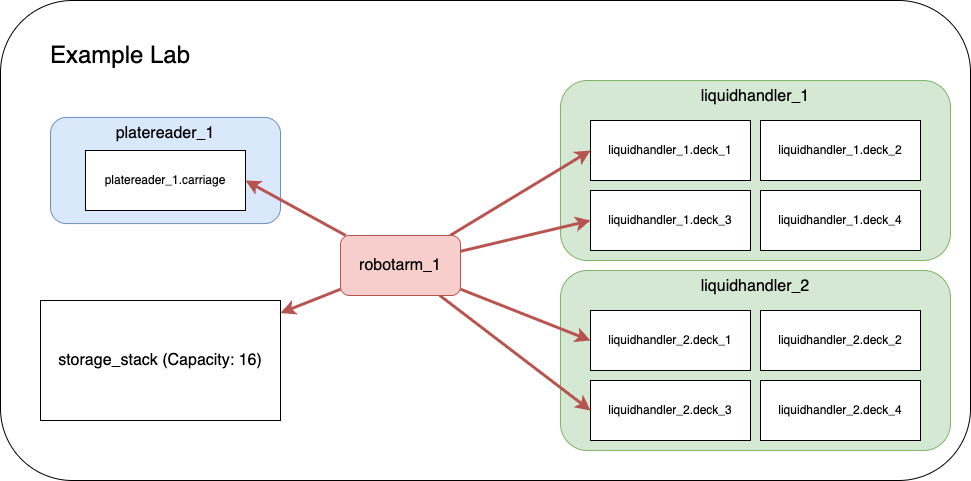

# Example MADSci Lab

This is a fully functional example of a MADSci-powered self-driving laboratory. It demonstrates the complete MADSci ecosystem including all core managers, multiple virtual laboratory nodes, and various workflows that showcase autonomous experimentation capabilities.

## Lab Architecture

The example lab simulates a real laboratory environment with:

### Infrastructure Services
- **MongoDB** (Port 27017): Event and experiment data storage
- **PostgreSQL** (Port 5432): Resource and inventory management
- **Redis** (Port 6379): Real-time state management and task queuing
- **MinIO** (Port 9000/9001): Object storage for data files

### Core Managers
- **Lab Manager** (Port 8000): Central dashboard and lab coordination
- **Event Manager** (Port 8001): Distributed event logging and monitoring
- **Experiment Manager** (Port 8002): Experimental runs and campaign management
- **Resource Manager** (Port 8003): Laboratory resource and inventory tracking
- **Data Manager** (Port 8004): Data capture, storage, and querying
- **Workcell Manager** (Port 8005): Workflow coordination and scheduling
- **Location Manager** (Port 8006): Laboratory location management and resource attachments

### Laboratory Nodes
- **liquidhandler_1** (Port 2000): First liquid handling robot
- **liquidhandler_2** (Port 2001): Second liquid handling robot
- **robotarm_1** (Port 2002): Robotic arm for material transfer
- **platereader_1** (Port 2003): Plate reader for measurements
- **advanced_example_node** (Port 2004): Advanced node demonstrating complex workflows



## Prerequisites

Before starting the example lab, ensure you have:

1. **Docker**: Docker Desktop (recommended) or Rancher Desktop
   - Docker Compose v2.0 or higher
   - At least 4GB RAM allocated to Docker
   - At least 10GB free disk space

2. **Network Requirements**:
   - Ports 2000-2004, 5432, 6379, 8000-8006, 9000-9001, and 27017 available
   - Internet access for pulling Docker images

3. **System Requirements**:
   - Linux, macOS, or Windows with WSL2
   - x86_64 or arm64 architecture

## Quick Start

### 1. Start the Example Lab

From the root of the MADSci repository:

```bash
# Start all services
docker compose up

# Or start in detached mode (runs in background)
docker compose up -d

# View logs if running detached
docker compose logs -f
```

### 2. Verify Lab Status

Once all services are running (this may take 1-2 minutes), verify the lab is operational:

```bash
# Check service health
docker compose ps

# Verify managers are responding
curl http://localhost:8000/health  # Lab Manager
curl http://localhost:8001/health  # Event Manager
curl http://localhost:8002/health  # Experiment Manager
curl http://localhost:8003/health  # Resource Manager
curl http://localhost:8004/health  # Data Manager
curl http://localhost:8005/health  # Workcell Manager
curl http://localhost:8006/health  # Location Manager

# Check node status
curl http://localhost:2000/health  # liquidhandler_1
curl http://localhost:2001/health  # liquidhandler_2
curl http://localhost:2002/health  # robotarm_1
curl http://localhost:2003/health  # platereader_1
curl http://localhost:2004/health  # advanced_example_node
```

### 3. Access the Dashboard

Open your browser and navigate to: [http://localhost:8000](http://localhost:8000)

The dashboard provides:
- Real-time lab status monitoring
- Node management and control
- Workflow execution interface
- Data visualization tools
- System health monitoring

## Configuration

### Environment Variables

The lab can be customized using environment variables. Create a `.env` file in the repository root or modify the existing one:

```bash
# Copy the example environment file
cp .env.example .env

# Edit configuration as needed
nano .env
```

Key configuration options:
- **REPO_PATH**: Path to the repository (defaults to current directory)
- **USER_ID/GROUP_ID**: User permissions for Docker volumes
- **Database URLs**: Custom database connection strings
- **Manager URLs**: Custom service endpoints

### Manager Configuration

Each manager can be configured through YAML files in `managers/`:

- `example_lab.manager.yaml`: Lab manager configuration
- `example_event.manager.yaml`: Event manager settings
- `example_experiment.manager.yaml`: Experiment manager setup
- `example_resource.manager.yaml`: Resource manager configuration
- `example_data.manager.yaml`: Data manager settings
- `example_workcell.manager.yaml`: Workcell manager configuration
- `example_location.manager.yaml`: Location manager setup

### Node Configuration

Node definitions are located in `node_definitions/`:

- Each node has both a `.node.yaml` (configuration) and `.info.yaml` (metadata) file
- Configurations specify node capabilities, resources, and network settings
- Node modules are implemented in `example_modules/`

## Usage Examples

### Running Workflows

The example lab includes several pre-configured workflows demonstrating different capabilities:

#### 1. Simple Transfer Workflow
```bash
# Execute a basic resource transfer between liquid handlers
python -c "
from madsci.client.workcell_client import WorkcellClient
client = WorkcellClient()
result = client.execute_workflow('workflows/simple_transfer.workflow.yaml')
print(f'Workflow result: {result}')
"
```

#### 2. Multi-step Transfer Workflow
```bash
# Execute a complex workflow with multiple steps
python -c "
from madsci.client.workcell_client import WorkcellClient
client = WorkcellClient()
result = client.execute_workflow('workflows/multistep_transfer.workflow.yaml')
print(f'Workflow result: {result}')
"
```

#### 3. Minimal Test Workflow
```bash
# Run a simple test to verify lab functionality
python -c "
from madsci.client.workcell_client import WorkcellClient
client = WorkcellClient()
result = client.execute_workflow('workflows/minimal_test.workflow.yaml')
print(f'Workflow result: {result}')
"
```

### Interactive Learning

The example lab includes comprehensive **Jupyter notebooks** that provide hands-on tutorials:

#### 📓 **[experiment_notebook.ipynb](notebooks/experiment_notebook.ipynb)** - Experiment Development Tutorial
- Learn to create ExperimentApplications for automated research
- Work with all MADSci client libraries (Workcell, Resource, Location, Data, Experiment)
- Execute workflows and handle experimental data
- Build complete autonomous experiment loops
- **Interactive examples with live code execution**

#### 🔧 **[node_notebook.ipynb](notebooks/node_notebook.ipynb)** - Node Development Tutorial
- Understand MADSci Node architecture and lifecycle
- Learn to integrate laboratory instruments using RestNode
- Implement action methods and configuration
- Test nodes interactively with mock servers
- **Visual diagrams and step-by-step implementation**

**Start the notebooks:**
```bash
# Local Jupyter installation
cd notebooks/
jupyter lab

# Or use Docker environment
docker compose exec lab_manager jupyter lab --ip=0.0.0.0 --port=8888 --no-browser --allow-root
# Then open http://localhost:8888 in your browser
```

### Direct Node Interaction

Interact directly with individual nodes:

```bash
# Get node status
curl http://localhost:2000/status

# Execute a node action
curl -X POST http://localhost:2000/actions/prepare \
  -H "Content-Type: application/json" \
  -d '{"parameters": {}}'

# Query node capabilities
curl http://localhost:2000/definition
```

## Lab Tour

### 1. Dashboard Overview
The main dashboard at `http://localhost:8000` provides:
- **Lab Status**: Real-time overview of all nodes and managers
- **Active Workflows**: Currently running experiments and their progress
- **Resource Inventory**: Track plates, liquids, and other lab materials
- **Event Log**: System events and notifications
- **Data Browser**: Access experimental data and results

### 2. Node Management
- **Node Status**: Monitor individual instrument health and availability
- **Action Queue**: View pending and executing actions
- **Resource Tracking**: See what resources are attached to each node
- **Calibration**: Access node-specific calibration and maintenance tools

### 3. Workflow Execution
- **Workflow Library**: Browse available experimental protocols
- **Execution Monitor**: Track workflow progress in real-time
- **Parameter Setting**: Configure workflow parameters before execution
- **Result Visualization**: View experimental results and data

### 4. Data Management
- **Data Storage**: All experimental data is automatically captured
- **Query Interface**: Search and filter experimental results
- **Export Tools**: Download data in various formats
- **Visualization**: Built-in plotting and analysis tools

## Troubleshooting

### Common Issues

#### Services Won't Start
```bash
# Check Docker status
docker --version
docker compose --version

# Verify port availability
netstat -tuln | grep -E '(8000|8001|8002|8003|8004|8005|8006|2000|2001|2002|2003|2004|5432|6379|27017|9000|9001)'

# Check Docker resources
docker system df
docker system prune  # Clean up if needed
```

#### Database Connection Errors
```bash
# Reset database volumes
docker compose down -v
docker compose up

# Check database logs
docker compose logs postgres
docker compose logs mongodb
docker compose logs redis
```

#### Node Communication Issues
```bash
# Check node logs
docker compose logs liquidhandler_1
docker compose logs robotarm_1
docker compose logs platereader_1

# Verify node registration
curl http://localhost:8000/api/nodes

# Check workcell manager status
curl http://localhost:8005/status
```

#### Performance Issues
```bash
# Monitor resource usage
docker stats

# Check service health
docker compose ps

# Review system logs
docker compose logs --tail=50
```

### Log Files

Logs are available through Docker Compose:

```bash
# View all logs
docker compose logs

# Follow logs in real-time
docker compose logs -f

# View logs for specific service
docker compose logs lab_manager
docker compose logs liquidhandler_1

# Check system logs
docker compose logs --tail=100 -f
```

### Getting Help

If you encounter issues:

1. **Check the logs** using the commands above
2. **Verify configuration** in `.env` and manager YAML files
3. **Review port conflicts** with other running services
4. **Check Docker resources** and available disk space
5. **Consult the main documentation** in the repository root

## Advanced Usage

### Custom Node Development

To create custom nodes based on the examples:

1. **Study existing modules** in `example_modules/`
2. **Copy a similar node** (e.g., `liquidhandler.py`)
3. **Modify the node class** to implement your instrument's capabilities
4. **Update the node definition** YAML files
5. **Add the new node** to the compose.yaml file

### Workflow Development

Create custom workflows by:

1. **Examining existing workflows** in `workflows/`
2. **Understanding the workflow schema** (see MADSci documentation)
3. **Testing simple workflows** before creating complex ones
4. **Using the dashboard** to monitor workflow execution

### Integration with Real Hardware

To integrate real laboratory instruments:

1. **Replace virtual nodes** with real instrument drivers
2. **Update network configurations** for physical device IP addresses
3. **Modify resource templates** to match actual laboratory inventory
4. **Test thoroughly** in a safe environment before production use

### Scaling and Production Deployment

For production use:

1. **Use external databases** instead of containerized ones
2. **Implement proper authentication** and access controls
3. **Set up monitoring** and alerting systems
4. **Configure backup** and disaster recovery procedures
5. **Use container orchestration** (e.g., Kubernetes) for high availability

## Next Steps

1. **Explore the notebooks**: Run through `notebooks/experiment_notebook.ipynb` for hands-on experience
2. **Try different workflows**: Execute the various workflow examples
3. **Modify configurations**: Experiment with different lab setups
4. **Develop custom nodes**: Create virtual instruments for your specific needs
5. **Build custom workflows**: Design experiments specific to your research

## Learning Resources

### 📓 **Interactive Tutorials (Recommended)**
- **[experiment_notebook.ipynb](notebooks/experiment_notebook.ipynb)** - Complete experiment development with live code
- **[node_notebook.ipynb](notebooks/node_notebook.ipynb)** - Interactive node development with visual guides

### 📋 **Reference Documentation**
- **[WORKFLOW_GUIDE.md](WORKFLOW_GUIDE.md)** - Workflow schema and advanced patterns
- **[NODE_DEVELOPMENT_GUIDE.md](NODE_DEVELOPMENT_GUIDE.md)** - Production deployment patterns and quick reference
- **[TROUBLESHOOTING.md](TROUBLESHOOTING.md)** - Comprehensive problem-solving guide

### 📚 **Framework Documentation**
- [Configuration.md](../Configuration.md) - Complete configuration reference
- [Main README](../README.md) - MADSci overview and installation
- [Individual package documentation](../src/) - Detailed API references

## Stopping the Lab

When finished with the example lab:

```bash
# Stop all services (containers remain for restart)
docker compose stop

# Stop and remove all containers
docker compose down

# Stop, remove containers, and delete volumes (complete cleanup)
docker compose down -v --remove-orphans
```

The lab can be restarted at any time using `docker compose up`.
