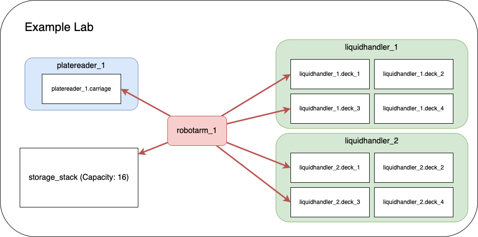

# Example MADSci Lab

This is a fully functional example of a MADSci-powered self-driving laboratory. It demonstrates the complete MADSci ecosystem including all core managers, multiple virtual laboratory nodes, and various workflows that showcase autonomous experimentation capabilities.

Currently, this lab uses simulated example modules for purely fake devices. For examples of real equipment integrated using MADSci, see [here](../../docs/madsci_powered/Modules.md).

## Lab Architecture

The example lab simulates a real laboratory environment with:

### Infrastructure Services
- **MongoDB** (Port 27017): Event and experiment data storage
- **PostgreSQL** (Port 5432): Resource and inventory management
- **Redis** (Port 6379): Real-time state management and task queuing
- **MinIO** (Port 9000/9001): Object storage for data files

### Core Managers
- **Lab Manager** (Port 8000): Central dashboard and lab coordination
- **Event Manager** (Port 8001): Distributed event logging and monitoring
- **Experiment Manager** (Port 8002): Experimental runs and campaign management
- **Resource Manager** (Port 8003): Laboratory resource and inventory tracking
- **Data Manager** (Port 8004): Data capture, storage, and querying
- **Workcell Manager** (Port 8005): Workflow coordination and scheduling
- **Location Manager** (Port 8006): Laboratory location management and resource attachments

### Laboratory Nodes
- **liquidhandler_1** (Port 2000): First liquid handling robot
- **liquidhandler_2** (Port 2001): Second liquid handling robot
- **robotarm_1** (Port 2002): Robotic arm for material transfer
- **platereader_1** (Port 2003): Plate reader for measurements
- **advanced_example_node** (Port 2004): Advanced node demonstrating complex workflows



## Prerequisites

Before starting the example lab, ensure you have:

1. **Docker**: Docker Desktop or Rancher Desktop
   - Docker Compose v2.0 or higher
   - At least 4GB RAM allocated to Docker
   - At least 10GB free disk space
   - Consult the [Docker Guide](https://github.com/AD-SDL/MADSci/wiki/Docker-Guide) for configuration and setup recommendations

2. **Network Requirements**:
   - Ports 2000-2004, 5432, 6379, 8000-8006, 9000-9001, and 27017 available
   - Internet access for pulling Docker images

3. **System Requirements**:
   - Linux, macOS, or Windows with WSL2
   - x86_64 or arm64 architecture

## Quick Start

If you're new to docker/docker compose, we recommend consulting our [Docker Guide](https://github.com/AD-SDL/MADSci/wiki/Docker-Guide) before jumping in.

### 1. Start the Example Lab

From the root of the MADSci repository:

```bash
# Start all services
docker compose up

# Or start in detached mode (runs in background)
docker compose up -d

# View logs if running detached
docker compose logs -f
```

### 2. Verify Lab Status

Once all services are running (this may take 1-2 minutes), verify the lab is operational:

```bash
# Check service health
docker compose ps

# Verify managers are responding
curl http://localhost:8000/health  # Lab Manager
curl http://localhost:8001/health  # Event Manager
curl http://localhost:8002/health  # Experiment Manager
curl http://localhost:8003/health  # Resource Manager
curl http://localhost:8004/health  # Data Manager
curl http://localhost:8005/health  # Workcell Manager
curl http://localhost:8006/health  # Location Manager

# Check node status
curl http://localhost:2000/health  # liquidhandler_1
curl http://localhost:2001/health  # liquidhandler_2
curl http://localhost:2002/health  # robotarm_1
curl http://localhost:2003/health  # platereader_1
curl http://localhost:2004/health  # advanced_example_node
```

### 3. Access the Dashboard

Open your browser and navigate to: [http://localhost:8000](http://localhost:8000)

The dashboard provides:
- Real-time lab status monitoring
- Node management and control
- Workflow execution interface
- Data visualization tools
- System health monitoring

## Configuration

This lab uses the modern **dual-layer configuration** pattern:

- **`settings.yaml`** contains default, non-secret configuration (server URLs, database names, manager metadata, and structural data references). This file is version-controlled and self-documenting.
- **`.env`** contains secrets and environment-specific overrides (database credentials, OTEL settings). This file is gitignored.
- **Environment variables** override both files with the highest precedence.

All structural data that managers need is configured directly in `settings.yaml` or pointed at standalone YAML files:

| Setting | File / Value | Purpose |
|---|---|---|
| `location_locations_file` | `locations.yaml` | Lab location definitions (deck positions, storage, etc.) |
| `location_transfer_capabilities_file` | `transfer_capabilities.yaml` | Transfer templates and routing configuration |
| `resource_default_templates_file` | `resource_templates.yaml` | Default resource templates (plate_nest, storage_stack) |
| `workcell_nodes` | *(inline dict)* | Node name → URL map for the workcell |

See [Configuration.md](../../Configuration.md) for the full configuration reference.

### Legacy Definition Files

The `managers/*.manager.yaml` files represent the **legacy definition-file pattern**. They are kept as examples of the older format but are **not loaded** by the lab — all structural data is now sourced from the standalone files and settings listed above.

See [Migration from Definitions](../../docs/guides/migration_from_definitions.md) for details on migrating from definition files to settings.

### Node Configuration

Node definitions are located in `node_definitions/`:

- Each node has both a `.node.yaml` (configuration) and `.info.yaml` (metadata) file
- Configurations specify node capabilities, resources, and network settings
- Node modules are implemented in `example_modules/`

## Usage Examples

### Running Workflows

The example lab includes several pre-configured workflows demonstrating different capabilities:

#### 1. Simple Transfer Workflow
```bash
# Execute a basic resource transfer between liquid handlers
python -c "
from madsci.client.workcell_client import WorkcellClient
client = WorkcellClient()
result = client.start_workflow('workflows/simple_transfer.workflow.yaml')
print(f'Workflow result: {result}')
"
```

#### 2. Multi-step Transfer Workflow
```bash
# Execute a complex workflow with multiple steps
python -c "
from madsci.client.workcell_client import WorkcellClient
client = WorkcellClient()
result = client.start_workflow('workflows/multistep_transfer.workflow.yaml')
print(f'Workflow result: {result}')
"
```

#### 3. Minimal Test Workflow
```bash
# Run a simple test to verify lab functionality
python -c "
from madsci.client.workcell_client import WorkcellClient
client = WorkcellClient()
result = client.start_workflow('workflows/minimal_test.workflow.yaml')
print(f'Workflow result: {result}')
"
```

### Interactive Learning

Comprehensive **Jupyter notebooks** are available in the [`examples/notebooks/`](../notebooks/) directory:

- **[experiment_notebook.ipynb](../notebooks/experiment_notebook.ipynb)** - Experiment Development Tutorial
- **[node_notebook.ipynb](../notebooks/node_notebook.ipynb)** - Node Development Tutorial
- **[backup_and_migration.ipynb](../notebooks/backup_and_migration.ipynb)** - Backup & Migration Tutorial
- **[example_utilization_plots.ipynb](../notebooks/example_utilization_plots.ipynb)** - Utilization Visualization

**Start the notebooks:**
```bash
# Local Jupyter installation
cd examples/notebooks/
jupyter lab

# Or use Docker environment
docker compose exec lab_manager jupyter lab --ip=0.0.0.0 --port=8888 --no-browser --allow-root
# Then open http://localhost:8888 in your browser
```

### Direct Node Interaction

Interact directly with individual nodes:

```bash
# Get node status
curl http://localhost:2000/status

# Execute a node action
curl -X POST http://localhost:2000/actions/prepare \
  -H "Content-Type: application/json" \
  -d '{"parameters": {}}'

# Query node capabilities
curl http://localhost:2000/definition
```

## Troubleshooting

### Common Issues

#### Services Won't Start
```bash
# Check Docker status
docker --version
docker compose --version

# Verify port availability
netstat -tuln | grep -E '(8000|8001|8002|8003|8004|8005|8006|2000|2001|2002|2003|2004|5432|6379|27017|9000|9001)'

# Check Docker resources
docker system df
docker system prune  # Clean up if needed
```

#### Database Connection Errors
```bash
# Reset database volumes
docker compose down -v
docker compose up

# Check database logs
docker compose logs postgres
docker compose logs mongodb
docker compose logs redis
```

#### Node Communication Issues
```bash
# Check node logs
docker compose logs liquidhandler_1
docker compose logs robotarm_1
docker compose logs platereader_1

# Verify node registration
curl http://localhost:8000/api/nodes

# Check workcell manager status
curl http://localhost:8005/status
```

For more troubleshooting guidance, see the [Troubleshooting Guide](../../docs/guides/troubleshooting.md).

## Observability Stack

The example lab includes optional OpenTelemetry observability with distributed tracing, metrics, and log aggregation:

```bash
# Start with full observability stack (Jaeger, Prometheus, Loki, Grafana)
docker compose -f compose.yaml -f compose.otel.yaml up
```

**Access the UIs:**
| Service    | URL                       | Description                        |
|------------|---------------------------|------------------------------------|
| Grafana    | http://localhost:3000     | Unified dashboards (admin/admin)   |
| Jaeger     | http://localhost:16686    | Distributed tracing UI             |
| Prometheus | http://localhost:9090     | Metrics querying                   |

See the [Observability Guide](../../docs/guides/observability.md) for detailed setup and configuration.

## Next Steps

1. **Explore the notebooks**: Run through the [experiment notebook](../notebooks/experiment_notebook.ipynb) for hands-on experience
2. **Try different workflows**: Execute the various workflow examples in `workflows/`
3. **Modify configurations**: Experiment with `settings.yaml` and `.env`
4. **Develop custom nodes**: See the [Node Development Guide](../../docs/guides/node_development.md)
5. **Build custom workflows**: See the [Workflow Development Guide](../../docs/guides/workflow_development.md)

## Related Documentation

- [Node Development Guide](../../docs/guides/node_development.md) - Production deployment patterns and quick reference
- [Workflow Development Guide](../../docs/guides/workflow_development.md) - Workflow schema and advanced patterns
- [Observability Guide](../../docs/guides/observability.md) - OpenTelemetry stack setup
- [Troubleshooting Guide](../../docs/guides/troubleshooting.md) - Comprehensive problem-solving guide
- [Configuration.md](../../Configuration.md) - Complete configuration reference
- [Main README](../../README.md) - MADSci overview and installation
- [Logging Guide](../../docs/guides/logging.md) - Structured logging and context management

## Stopping the Lab

When finished with the example lab:

```bash
# Stop all services (containers remain for restart)
docker compose stop

# Stop and remove all containers
docker compose down

# Stop, remove containers, and delete volumes (complete cleanup)
docker compose down -v --remove-orphans
```

The lab can be restarted at any time using `docker compose up`.
