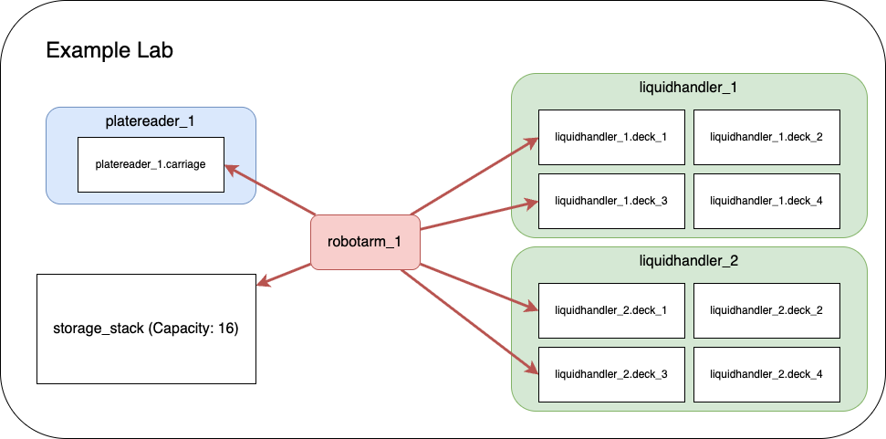

# Example MADSci Lab

This is a fully functional example of a MADSci-powered self-driving laboratory. It demonstrates the complete MADSci ecosystem including all core managers, multiple virtual laboratory nodes, and various workflows that showcase autonomous experimentation capabilities.

Currently, this lab uses simulated example modules for purely fake devices. For examples of real equipment integrated using MADSci, see [here](../../docs/madsci_powered/Modules.md).

## Lab Architecture

The example lab simulates a real laboratory environment with:

### Infrastructure Services
- **FerretDB** (Port 27017): Document database for event and experiment data (MongoDB-compatible, backed by PostgreSQL)
- **PostgreSQL** (Port 5432): FerretDB backend database
- **PostgreSQL** (Port 5434): Resource Manager relational database
- **Valkey** (Port 6379): Real-time state management and caching
- **SeaweedFS** (Port 8333/9333): S3-compatible object storage for data files

### Core Managers
- **Lab Manager** (Port 8000): Central dashboard and lab coordination
- **Event Manager** (Port 8001): Distributed event logging and monitoring
- **Experiment Manager** (Port 8002): Experimental runs and campaign management
- **Resource Manager** (Port 8003): Laboratory resource and inventory tracking
- **Data Manager** (Port 8004): Data capture, storage, and querying
- **Workcell Manager** (Port 8005): Workflow coordination and scheduling
- **Location Manager** (Port 8006): Laboratory location management and resource attachments
- **Auth Manager** (Port 8007): JWT-based identity service. Default-disabled at all consumers; opt in per [`docs/guides/auth_operator.md`](../../docs/guides/auth_operator.md).

### Laboratory Nodes
- **liquidhandler_1** (Port 2000): First liquid handling robot
- **liquidhandler_2** (Port 2001): Second liquid handling robot
- **robotarm_1** (Port 2002): Robotic arm for material transfer
- **platereader_1** (Port 2003): Plate reader for measurements
- **advanced_example_node** (Port 2004): Advanced node demonstrating complex workflows
- **sila_example_server** (Port 50052): Minimal SiLA2 server demonstrating the **experimental** `SilaNodeClient` (consumed via `sila://localhost:50052`). See [SiLA Example Server](#sila-example-server-experimental) below.



## Prerequisites

Before starting the example lab, ensure you have:

1. **Docker**: Docker Desktop or Rancher Desktop
   - Docker Compose v2.0 or higher
   - At least 4GB RAM allocated to Docker
   - At least 10GB free disk space
   - Consult the [Docker Guide](https://github.com/AD-SDL/MADSci/wiki/Docker-Guide) for configuration and setup recommendations

2. **Network Requirements**:
   - Ports 2000-2004, 5432, 5434, 6379, 8000-8006, 8333, 9333, 27017, and 50052 available
   - Internet access for pulling Docker images

3. **System Requirements**:
   - Linux, macOS, or Windows with WSL2
   - x86_64 or arm64 architecture

## Quick Start

If you're new to docker/docker compose, we recommend consulting our [Docker Guide](https://github.com/AD-SDL/MADSci/wiki/Docker-Guide) before jumping in.

### 1. Start the Example Lab

From the root of the MADSci repository:

```bash
# Start all services
docker compose up

# Or start in detached mode (runs in background)
docker compose up -d

# View logs if running detached
docker compose logs -f
```

### 2. Verify Lab Status

Once all services are running (this may take 1-2 minutes), verify the lab is operational:

```bash
# Check service health
docker compose ps

# Verify managers are responding
curl http://localhost:8000/health  # Lab Manager
curl http://localhost:8001/health  # Event Manager
curl http://localhost:8002/health  # Experiment Manager
curl http://localhost:8003/health  # Resource Manager
curl http://localhost:8004/health  # Data Manager
curl http://localhost:8005/health  # Workcell Manager
curl http://localhost:8006/health  # Location Manager

# Check node status
curl http://localhost:2000/health  # liquidhandler_1
curl http://localhost:2001/health  # liquidhandler_2
curl http://localhost:2002/health  # robotarm_1
curl http://localhost:2003/health  # platereader_1
curl http://localhost:2004/health  # advanced_example_node

# SiLA example server uses gRPC, not HTTP — verify with a TCP probe instead:
python -c "import socket; s=socket.socket(); s.settimeout(2); s.connect(('localhost', 50052)); print('sila_example_server reachable')"
```

### 3. Access the Dashboard

Open your browser and navigate to: [http://localhost:8000](http://localhost:8000)

The dashboard provides:
- Real-time lab status monitoring
- Node management and control
- Workflow execution interface
- Data visualization tools
- System health monitoring

## Auth Manager bootstrap (optional)

The example lab boots `auth_manager` (port 8007) but every consumer leaves
`auth_enabled=False`, so existing scripts and notebooks keep working without
any token. To explore the auth flow:

```bash
# 1. Bootstrap the Auth Manager (pick any ULID for lab_id)
docker compose exec auth_manager madsci auth bootstrap \
  --username admin --password hunter2 \
  --lab-id 01HZZ0000000000000000000A0

# 2. Verify
curl -s -X POST http://localhost:8007/token \
  -d 'grant_type=password&username=admin&password=hunter2' | jq

# 3. Inspect the JWKS
curl -s http://localhost:8007/.well-known/jwks.json | jq
```

To enable auth on a single consumer in **migration mode** (observe-only),
add to that manager's settings:

```yaml
auth_enabled: true
auth_required: false        # accept unauth'd requests, log warnings
auth_server_url: "http://auth_manager:8007/"
```

See [`docs/guides/auth_operator.md`](../../docs/guides/auth_operator.md)
for the full rollout (registering managers/nodes, key rotation, secret
distribution).

## Configuration

This lab uses the modern **dual-layer configuration** pattern:

- **`settings.yaml`** contains default, non-secret configuration (server URLs, database names, manager metadata, and structural data references). This file is version-controlled and self-documenting.
- **`.env`** contains secrets and environment-specific overrides (database credentials, OTEL settings). This file is gitignored.
- **Environment variables** override both files with the highest precedence.

All structural data that managers need is configured directly in `settings.yaml`:

| Setting | Purpose |
|---|---|
| `location_locations` | Lab location definitions (deck positions, storage, etc.) |
| `location_transfer_capabilities` | Transfer templates and routing configuration |
| `resource_default_templates` | Default resource templates (plate_nest, storage_stack) |
| `workcell_nodes` | Node name → URL map for the workcell |

See [Configuration.md](../../docs/Configuration.md) for the full configuration reference.

### Node Configuration

Nodes are configured via environment variables in `compose.yaml` (`NODE_NAME`, `NODE_MODULE_NAME`, `NODE_URL`). These can also be set in per-node `settings.yaml` files for local development. Node modules are implemented in `example_modules/`.

### Legacy Definition Files

The `managers/*.manager.yaml` and `node_definitions/*.node.yaml` files represent the **legacy definition-file pattern**. They are kept as historical examples of the older format but are **not loaded** by the lab — all configuration is now sourced from `settings.yaml`, `.env`, and environment variables.

See [Migration from Definitions](../../docs/guides/migration_from_definitions.md) for details on migrating from definition files to settings.

## Usage Examples

### Running Workflows

The example lab includes several pre-configured workflows demonstrating different capabilities:

#### 1. Simple Transfer Workflow
```bash
# Execute a basic resource transfer between liquid handlers
python -c "
from madsci.client.workcell_client import WorkcellClient
client = WorkcellClient()
result = client.start_workflow('workflows/simple_transfer.workflow.yaml')
print(f'Workflow result: {result}')
"
```

#### 2. Multi-step Transfer Workflow
```bash
# Execute a complex workflow with multiple steps
python -c "
from madsci.client.workcell_client import WorkcellClient
client = WorkcellClient()
result = client.start_workflow('workflows/multistep_transfer.workflow.yaml')
print(f'Workflow result: {result}')
"
```

#### 3. Minimal Test Workflow
```bash
# Run a simple test to verify lab functionality
python -c "
from madsci.client.workcell_client import WorkcellClient
client = WorkcellClient()
result = client.start_workflow('workflows/minimal_test.workflow.yaml')
print(f'Workflow result: {result}')
"
```

### Interactive Learning

Comprehensive **Jupyter notebooks** are available in the [`examples/notebooks/`](../notebooks/) directory:

- **[experiment_notebook.ipynb](../notebooks/experiment_notebook.ipynb)** - Experiment Development Tutorial
- **[node_notebook.ipynb](../notebooks/node_notebook.ipynb)** - Node Development Tutorial
- **[backup_and_migration.ipynb](../notebooks/backup_and_migration.ipynb)** - Backup & Migration Tutorial
- **[example_utilization_plots.ipynb](../notebooks/example_utilization_plots.ipynb)** - Utilization Visualization
- **[sila_node_notebook.ipynb](../notebooks/sila_node_notebook.ipynb)** - **(Experimental)** Consuming a SiLA2 device via `SilaNodeClient`

**Start the notebooks:**
```bash
# Local Jupyter installation
cd examples/notebooks/
jupyter lab

# Or use Docker environment
docker compose exec lab_manager jupyter lab --ip=0.0.0.0 --port=8888 --no-browser --allow-root
# Then open http://localhost:8888 in your browser
```

### Direct Node Interaction

Interact directly with individual nodes:

```bash
# Get node status
curl http://localhost:2000/status

# Execute a node action
curl -X POST http://localhost:2000/actions/prepare \
  -H "Content-Type: application/json" \
  -d '{"parameters": {}}'

# Query node capabilities
curl http://localhost:2000/info
```

## Troubleshooting

### Common Issues

#### Services Won't Start
```bash
# Check Docker status
docker --version
docker compose --version

# Verify port availability
netstat -tuln | grep -E '(8000|8001|8002|8003|8004|8005|8006|2000|2001|2002|2003|2004|5432|5434|6379|27017|8333|9333|50052)'

# Check Docker resources
docker system df
docker system prune  # Clean up if needed
```

#### Database Connection Errors
```bash
# Reset database volumes
docker compose down -v
docker compose up

# Check database logs
docker compose logs postgres
docker compose logs madsci_ferretdb
docker compose logs madsci_valkey
```

#### Node Communication Issues
```bash
# Check node logs
docker compose logs liquidhandler_1
docker compose logs robotarm_1
docker compose logs platereader_1

# Verify node registration
curl http://localhost:8000/api/nodes

# Check workcell manager status
curl http://localhost:8005/status
```

For more troubleshooting guidance, see the [Troubleshooting Guide](../../docs/guides/troubleshooting.md).

## Observability Stack

The example lab includes optional OpenTelemetry observability with distributed tracing, metrics, and log aggregation:

```bash
# Start with full observability stack (Jaeger, Prometheus, Loki, Grafana)
# Run from the repository root:
docker compose --profile otel up
```

**Access the UIs:**
| Service    | URL                       | Description                        |
|------------|---------------------------|------------------------------------|
| Grafana    | http://localhost:3000     | Unified dashboards (admin/admin)   |
| Jaeger     | http://localhost:16686    | Distributed tracing UI             |
| Prometheus | http://localhost:9090     | Metrics querying                   |

See the [Observability Guide](../../docs/guides/observability.md) for detailed setup and configuration.

## Next Steps

1. **Explore the notebooks**: Run through the [experiment notebook](../notebooks/experiment_notebook.ipynb) for hands-on experience
2. **Try different workflows**: Execute the various workflow examples in `workflows/`
3. **Modify configurations**: Experiment with `settings.yaml` and `.env`
4. **Develop custom nodes**: See the [Node Development Guide](../../docs/guides/node_development.md)
5. **Build custom workflows**: See the [Workflow Development Guide](../../docs/guides/workflow_development.md)

## Related Documentation

- [Node Development Guide](../../docs/guides/node_development.md) - Production deployment patterns and quick reference
- [Workflow Development Guide](../../docs/guides/workflow_development.md) - Workflow schema and advanced patterns
- [Observability Guide](../../docs/guides/observability.md) - OpenTelemetry stack setup
- [Troubleshooting Guide](../../docs/guides/troubleshooting.md) - Comprehensive problem-solving guide
- [Configuration.md](../../docs/Configuration.md) - Complete configuration reference
- [Main README](../../README.md) - MADSci overview and installation
- [Logging Guide](../../docs/guides/logging.md) - Structured logging and context management

## Location Templates

The example lab demonstrates the **location template system** for declarative location management.

### Node-Defined Representation Templates

Both `RobotArmNode` and `LiquidHandlerNode` define `location_representation_templates` with JSON Schema definitions:

- **`robotarm_deck_access`** / **`robotarm_wide_access`** -- defined in `example_modules/robotarm.py`. Specify joint positions, gripper configuration, and payload limits. The `position` field is a required override (varies per physical location).
- **`lh_deck_repr`** -- defined in `example_modules/liquidhandler.py`. Specifies deck slot number, deck type, and plate capacity. The `deck_position` field is a required override.

These templates are registered with the Location Manager automatically at node startup via `template_handler()`.

### Seed File (`locations.yaml`)

The `locations.yaml` file pre-populates the Location Manager on first startup. It defines:

1. **Representation templates** -- `robotarm_deck_access`, `robotarm_wide_access`, `lh_deck_repr`
2. **Location templates** -- `lh_accessible_deck_slot` (liquid handler + robot arm access) and `lh_only_deck_slot` (liquid handler only)
3. **Concrete locations** -- deck slots for `liquidhandler_1` and `liquidhandler_2`, each with node bindings mapping abstract roles (`deck_controller`, `transfer_arm`) to concrete node instances and per-location overrides (deck position, joint angles)

Inline (non-template) locations like `storage_rack` and `platereader_1.plate_carriage` are also supported for locations that do not fit a reusable template pattern.

### Dashboard Integration

Once the lab is running, navigate to the **Locations** tab in the dashboard at [http://localhost:8000](http://localhost:8000). From there you can:

- View all locations with their representations and template lineage
- Create new locations from registered templates, selecting node bindings and filling in required overrides via schema-aware forms
- Edit representations on existing locations

See the [Location Templates Guide](../../docs/guides/integrator/10-location-templates.md) for full documentation.

## SiLA Example Server (Experimental)

> **Status:** Experimental. The `SilaNodeClient` and the `sila_example_server` ship as a preview of native SiLA2 integration. The client surface, the example server's Feature shape, and the install path may change. The broader migration is scoped in [`openspec/changes/sila2-native-node-design/`](../../openspec/changes/sila2-native-node-design/) (project umbrella: issue #293).

The example lab includes a minimal SiLA2 server (`example_modules/sila_example_server/`) that demonstrates how to consume a SiLA2-based device from MADSci using `SilaNodeClient`. It exposes one Feature, `ExampleDevice`, with:

- `Greet` — unobservable command (synchronous).
- `CountDown` — observable command (long-running, with intermediate progress).
- `GenerateData` — returns binary data, surfaced as `ActionFiles` on the client side.
- `ServerUptime` — typed Property.

The compose service runs the server on `0.0.0.0:50052` (insecure / discovery disabled for the example), with a TCP-socket healthcheck. It is wired into the workcell node map in `settings.yaml` as:

```yaml
workcell_nodes:
  sila_example: sila://localhost:50052
```

### Trying it out

```bash
# Install the experimental SiLA extra
pip install "madsci.client[sila]"

# Connect to the example server (lab must be running: `docker compose up`)
python -c "
from madsci.client.node.sila_node_client import SilaNodeClient
from madsci.common.types.action_types import ActionRequest

client = SilaNodeClient(url='sila://localhost:50052')
info = client.get_info()
print('Actions:', list(info.actions))

result = client.send_action(ActionRequest(
    action_name='ExampleDevice.Greet',
    args={'Name': 'MADSci'},
))
print(result.json_result)
client.close()
"
```

For an end-to-end walkthrough (introspection, observable polling, binary data, error handling), open [`examples/notebooks/sila_node_notebook.ipynb`](../notebooks/sila_node_notebook.ipynb). The notebook is also the SiLA validation harness — `just validate_nb_sila` executes it via papermill against the running compose service.

## Stopping the Lab

When finished with the example lab:

```bash
# Stop all services (containers remain for restart)
docker compose stop

# Stop and remove all containers
docker compose down

# Stop, remove containers, and delete volumes (complete cleanup)
docker compose down -v --remove-orphans
```

The lab can be restarted at any time using `docker compose up`.
