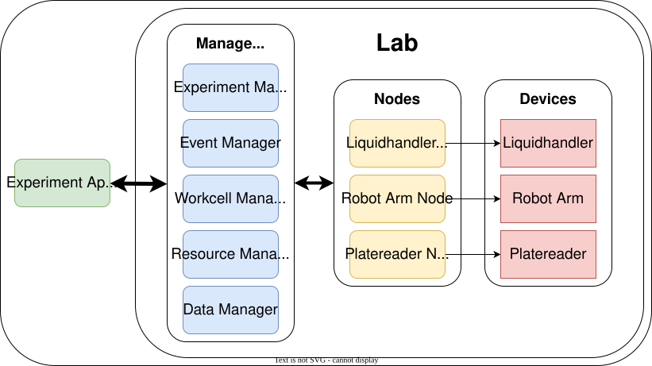

:::{image} assets/madsci_logo.svg
:alt: MADSci — Modular Autonomous Discovery for Science
:width: 340px
:align: center
:::

# MADSci

**Modular Autonomous Discovery for Science** — an open-source Python framework for
building modular, autonomous scientific laboratories.

## What is MADSci?

MADSci makes it easier to build **self-driving labs (SDLs)** — laboratories that
close the loop between experiment design, execution, and analysis so that AI and
optimization algorithms can drive discovery with minimal human intervention.

Standing up an SDL usually means integrating a zoo of heterogeneous instruments,
robots, and data systems — a large and repetitive systems-engineering burden.
MADSci lowers that barrier by providing a common standard for wrapping any
instrument or robot as a **Node**, plus a suite of independent **manager
services** you can use on their own or compose into a full autonomous lab:

- **Instrument automation & integration** — wrap any device as a MADSci Node behind a common (REST) interface, in any language.
- **Workflow management** — define and run flexible workflows across one or more nodes.
- **Experiment management** — run closed-loop autonomous experiments combining workflows, compute, decision-making, and analysis.
- **Resource management** — track labware, consumables, equipment, samples, and assets.
- **Event & data management** — distributed logging and data capture across the whole lab.
- **Location management** — coordinate physical locations and their node/resource representations.
- **Observability** — built-in OpenTelemetry tracing, metrics, and log correlation.



::::{grid} 1 1 2 2
:::{card} 🚀 Get started
:link: docs/tutorials/01-exploration.md
New to MADSci? Walk through the tutorials, from exploration to a full lab.
:::
:::{card} 🧭 Guides
:link: docs/guides/node_development.md
Integrate instruments, build workflows, run experiments, and operate a lab.
:::
:::{card} 🧪 Example lab
:link: examples/example_lab/README.md
A complete working lab you can run locally to see MADSci in action.
:::
:::{card} 🔌 API reference
:link: docs/api/madsci/index.md
Full Python API documentation for every MADSci package.
:::
::::

:::{note} MADSci is in beta
Most core functionality is working and tested, but releases may include breaking
changes. We recommend **pinning the MADSci version** in your dependencies and
reviewing the [release notes](docs/CHANGELOG.md) before upgrading.
:::

## How to cite

If you use MADSci in your work, please cite our paper in the
_Journal of Open Source Software_:

> Lewis, R. D., Ginsburg, T. S., Ozgulbas, D., Stone, C., Stroka, A., Cleary, A.,
> Foster, I. T., & Paulson, N. (2026). MADSci: A modular Python-based framework to
> enable autonomous science. _Journal of Open Source Software_, 11(119), 9416.
> <https://doi.org/10.21105/joss.09416>

```bibtex
@article{Lewis2026MADSci,
  title     = {{MADSci}: A modular {Python}-based framework to enable autonomous science},
  author    = {Lewis, Ryan D. and Ginsburg, Tobias S. and Ozgulbas, Doga and Stone, Casey and Stroka, Abraham and Cleary, Aileen and Foster, Ian T. and Paulson, Noah},
  journal   = {Journal of Open Source Software},
  publisher = {Open Journals},
  year      = {2026},
  volume    = {11},
  number    = {119},
  pages     = {9416},
  doi       = {10.21105/joss.09416},
  url       = {https://doi.org/10.21105/joss.09416}
}
```

## Instruments & robots

MADSci drives **36 instruments, robots and controllers** today: Opentrons and Hudson
liquid handlers, Universal Robots and PreciseFlex arms, plate readers, an SEM, a
battery cycler, humanoid platforms, a 3D printer and beamline temperature control.
Each one is a reusable module you can pick up and run against your own hardware.

See **[Integrated Equipment](docs/equipment.md)** for the full list, grouped by
function and linked to every module, or the [Equipment Integrator
Guide](docs/guides/integrator/README.md) to build a module for hardware that is not
there yet.

## Contributors

MADSci is developed by the **Rapid Prototyping Lab at Argonne National
Laboratory** and a growing community. The paper authors and core contributors
are Ryan D. Lewis, Tobias S. Ginsburg, Doga Ozgulbas, Casey Stone, Abraham
Stroka, Aileen Cleary, Ian T. Foster, and Noah Paulson.

See the full list of everyone who has contributed on the
[contributors graph](https://github.com/AD-SDL/MADSci/graphs/contributors).
Contributions are welcome — see the [Contributing Guide](CONTRIBUTING.md) to get
involved.

---

:::{image} assets/logos/argonne.svg
:alt: Argonne National Laboratory
:height: 52px
:align: center
:::

<p style="text-align:center; font-size:0.9em; opacity:0.75;">
Developed by the Rapid Prototyping Lab at <strong>Argonne National Laboratory</strong>.<br/>
Argonne is a U.S. Department of Energy laboratory managed by UChicago Argonne, LLC.
</p>
