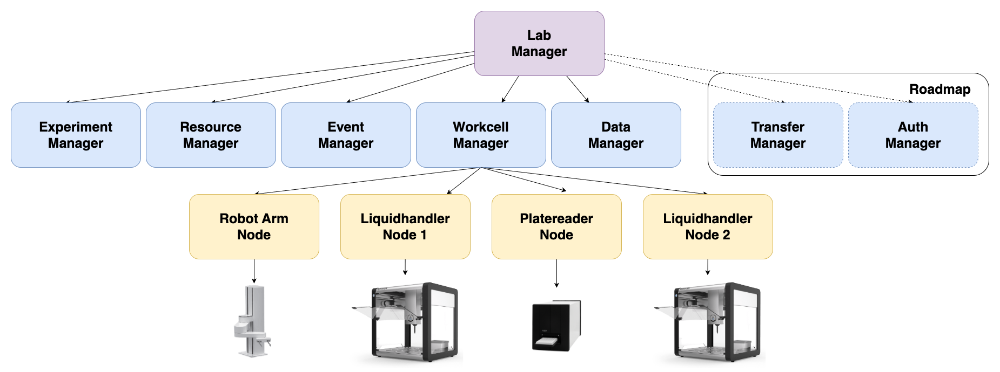

# Summary

The Modular Autonomous Discovery for Science (MADSci) toolkit enables laboratory automation, high-throughput experimentation, and self-driving labs.
Laboratory operators define workcells as collections of **Nodes** controlling individual instruments, robots, or devices.
These nodes, combined with **Managers** providing lab functionality and coordination, form flexible laboratories.
Users create and run experimental campaigns using Python applications and YAML workflow definitions.
This design separates concerns between device integrators, lab operators, and domain scientists.
MADSci enables science in biology, chemistry, materials science, and quantum science.

# Statement of Need

The lab automation ecosystem is fragmented, with many proprietary, costly, or narrowly domain-specific tools.
MADSci provides an open-source, extensible, domain-agnostic toolkit for labs.
It integrates equipment, sensors, and robots as "nodes," with managers for workflows, resources, experiments, logging, and data collection.
Built on a microservices architecture with developer-friendly RESTful APIs and Python clients, MADSci leverages standard databases (PostgreSQL, MongoDB, Redis, MiniIO) and open-source libraries (FastAPI, Pydantic, SQLModel) to ensure adaptability and extensibility.

Laboratory automation software systems exhibit distinct architectural approaches and domain focus areas that influence their applicability across research environments.
Commercial platforms such as Chemspeed's Autosuite [@seifrid2024chemspyd] and Retisoft Genera [@retisoft2024genera] provide comprehensive functionality but operate under proprietary licensing models that may limit accessibility in academic settings.
Open-source alternatives including AlabOS [@fei2024alabos], ChemOS [@sim2024chemos; @roch2020chemos], and Bluesky [@allan2019bluesky] demonstrate strong capabilities within specific research domains but exhibit varying degrees of cross-disciplinary transferability.
Specialized systems such as Polybot [@wang2025autonomous; @vriza2023selfdriving] showcase advanced automation features tailored to particular scientific applications.
The Workcell Execution Interface [@vescovi2023modular], MADSci's predecessor, has a similar focus on instrument modularity but lacks some of the advanced features and microservices principles at the management layer.
MADSci represents an open-source, modular framework designed to provide domain-agnostic laboratory automation capabilities while maintaining compatibility with diverse instrumentation ecosystems and institutional deployment requirements.

## Software Architecture and Features

MADSci's microservice architecture enables separation of concerns among system components.

### Nodes

MADSci enables integration of lab equipment, devices, robots, and sensors via the **Node** Protocol \autoref{fig:madsci_architecture}.

Any software implementing common API endpoints can be used as a MADSci Node. We provide a `RestNode` Python class for easy device integration. Key endpoints include `/action` for device functionality, `/status` for node state, `/state` for device information, `/admin` for administrative commands, and `/info` for metadata and capabilities.

We provide RESTful and abstract implementations to enable diverse integrations.

### Workcell and Workflow Management

The MADSci Workcell Manager handles the operation of a **Workcell**--a collection of **Nodes**, **Locations**, and **Resources** that are scheduled together--to perform **Workflows**. A self-driving lab may comprise one or more Workcells, each able to execute workflows semi-independently.

At the core of the workcell manager is the scheduler, which determines which steps in active workflow(s) to run next based on the current state of the workcell's nodes, locations, and resources.
A modular design allows this component to be swapped out by a lab operator to meet specific requirements of their lab.
We include an opportunistic first-in-first-out scheduler as a default.

Workflows can be defined using YAML syntax or Pydantic-based Python data models.
In either case, a workflow consists of a linear sequence of steps to be run on individual nodes.
A Step Definition specifies a node, an action, and any (required or optional) action arguments.
In addition to standard JSON-serializable arguments, workflow steps can include Location or File arguments.
The values of location arguments are provided by the Workcell at runtime; the WorkcellManager substitutes an appropriate representation.

Workflows are parameterizable: users can specify the node, action, or arguments for certain steps at submission time.
This enables reusable template workflows.
The output from previous steps can inform parameter values for later steps, allowing simple intra-workflow data flow.

### Experiment Management

MADSci's Experiment Manager allows users to define experimental campaigns, start experiment runs associated with those campaigns, and link MADSci objects (workflows, resources, datapoints, etc) with experimental runs.
The Experiment Manager supports Experiment Designs, which allow users to specify the properties and conditions of experiments.

An included `ExperimentApplication` class provides a foundation for defining experimental applications in Python, including clients for lab interaction and helper methods for common needs.
This class can run as a standard Python script or as a MADSci Rest node, enabling experiment-specific actions in workflows that can be monitored from the Lab Dashboard.
The scaffolded design makes laboratory capabilities accessible while remaining simple and flexible for integration with other Python tools and workflows.

### Data Management

MADSci's Data Manager supports the creation, storage, and querying of data generated by any component of the system during autonomous experimentation.
The Data Manager currently supports the storage and querying of JSON-serializable data directly in MongoDB, storing file-based data either on a filesystem or in S3-compatible object storage.
When working with large datasets where extra transfer steps are undesirable, the `DataClient` implementation optionally supports direct upload to object storage.

### Resource Management

Autonomous labs rely on consumables, labware, and other assets, often organized into containers.
Our Resource Manager provides flexible tools to define, validate, track, and manage these resources across their lifecycle.
Built on PostgreSQL, it supports many asset types, including nested resources, and lets users customize properties while interacting through a standardized set of operations.
It also maintains automated histories and locking to ensure provenance and reliability.

### Event Management and Logging

The MADSci Event Manager lets nodes and managers log JSON events to a central system backed by MongoDB, which supports advanced queries. The EventClient can also log to the terminal or files using Python’s standard logging library, making it easy to reuse existing Python logging code.

### Lab Management

The MADSci Lab Manager provides a primary entrypoint for users and applications.
A web-based Dashboard provides both overview and detailed information on the lab's status, performance, and history.
Additionally, the lab manager's API surfaces important context about the lab, including information about what managers are available.

---

# Acknowledgements

The authors acknowledge financial support from Laboratory Directed Research and Development (LDRD) funding from Argonne National Laboratory, provided by the Director, Office of Science, of the U.S. Department of Energy under Contract No. DE-AC02-06CH11357.

# References
